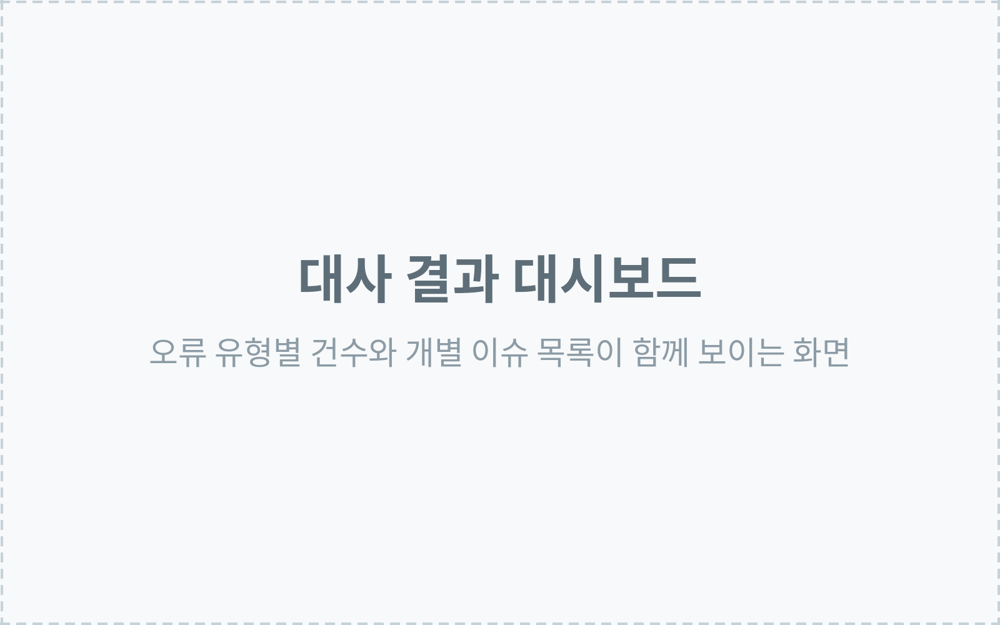

# sobetty — 김소영 포트폴리오

<https://ssoju-kim.github.io/sobetty/>

HTML · CSS · 바닐라 JavaScript 정적 사이트입니다. 빌드 도구도 프레임워크도 없습니다.
`index.html` 을 브라우저에서 그대로 열어도 동작합니다.

```
index.html
assets/css/site.css     화면용
assets/css/print.css    인쇄용 (media="print")
assets/js/app.js        내비게이션 표시와 연도만 — 없어도 사이트는 정상 동작
assets/docs/            경력기술서 PDF · DOCX
```

---

## 이미지 넣기

이미지는 아직 없고, 자리마다 회색 자리표시자가 들어가 있습니다.
자리표시자 안에 **넣을 이미지 이름과 권장 비율**이 적혀 있습니다.

바꾸는 방법은 `<div class="ph …">…</div>` 한 덩어리를 `` 한 줄로 교체하는 것입니다.
비율 클래스를 맞춰 주면 자리표시자와 크기가 똑같이 유지됩니다.

```html
<!-- 바꾸기 전 -->
<div class="ph ph-16x9" role="img" aria-label="…">…</div>

<!-- 바꾼 뒤 -->

```

| 비율 | 클래스 | 쓰는 곳 | 이미지 처리 |
| --- | --- | --- | --- |
| 4:5 | `.hero-photo img` (클래스 불필요) | 프로필 사진 | 꽉 채움 |
| 16:9 | `img-16x9` | 프로젝트 대표 이미지 | 꽉 채움 |
| 4:3 | `img-4x3` | 프로젝트 추가 이미지 | 잘리지 않게 맞춤 |

- 휴대폰 세로 화면도 **4:3 자리에 그대로** 넣으면 됩니다. 잘리지 않고 남는 공간은 배경색으로 채워집니다.
- 권장 가로 1400px 이상. `alt` 는 반드시 채워 주세요.
- 첫 화면에 보이는 이미지(프로필, 첫 프로젝트 대표)에는 `loading="lazy"` 를 넣지 마세요.
- 넣기 전에 회사 내부 경로 · 서버 정보 · API 키 · 고객 정보를 가리거나 지워 주세요.

---

## 내용 고치기

`index.html` 을 직접 수정합니다. 구조는 이 순서입니다.

`Hero → 주요 경험 → 실무 경험 → 주요 프로젝트 → 그 밖의 프로젝트 → 학력·자격증·기술 → 연락`

프로젝트는 모두 같은 순서를 씁니다.

```
프로젝트 성격·기간·팀 구성  →  제목  →  한 문장 소개  →  핵심 결과
→  대표 이미지(16:9)  →  본인 역할 · 주요 수행 내용  →  추가 이미지(4:3)
→  기술 · 링크
```

글자 크기는 `assets/css/site.css` 의 `:root` 에 있는 `--fs-*` 값만 고치면 전체에 반영됩니다.
색은 `--ink`(제목·수치) → `--body`(본문) → `--dim`(보조정보) 세 단계와 포인트 색 `--accent` 하나만 씁니다.

---

## PDF로 저장

브라우저에서 `Ctrl/Cmd + P` → 대상 "PDF로 저장" → A4 → **배경 그래픽 켜기**.

---

## 배포

`main` 에 병합되면 GitHub Pages 가 자동 반영합니다.
**Settings → Pages** 의 Source 가 `Deploy from a branch`, 브랜치가 `main` / `/ (root)` 인지 확인하세요.
